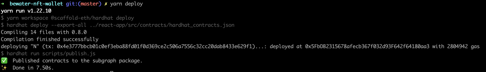
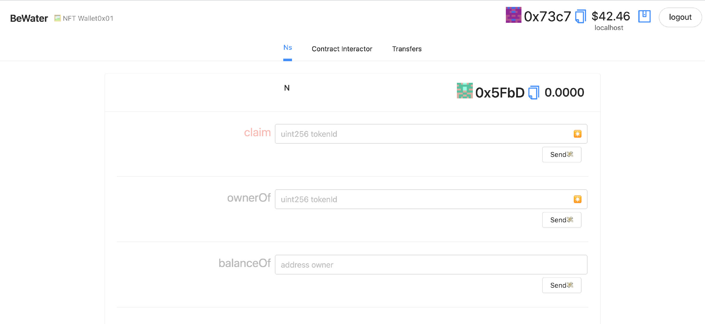
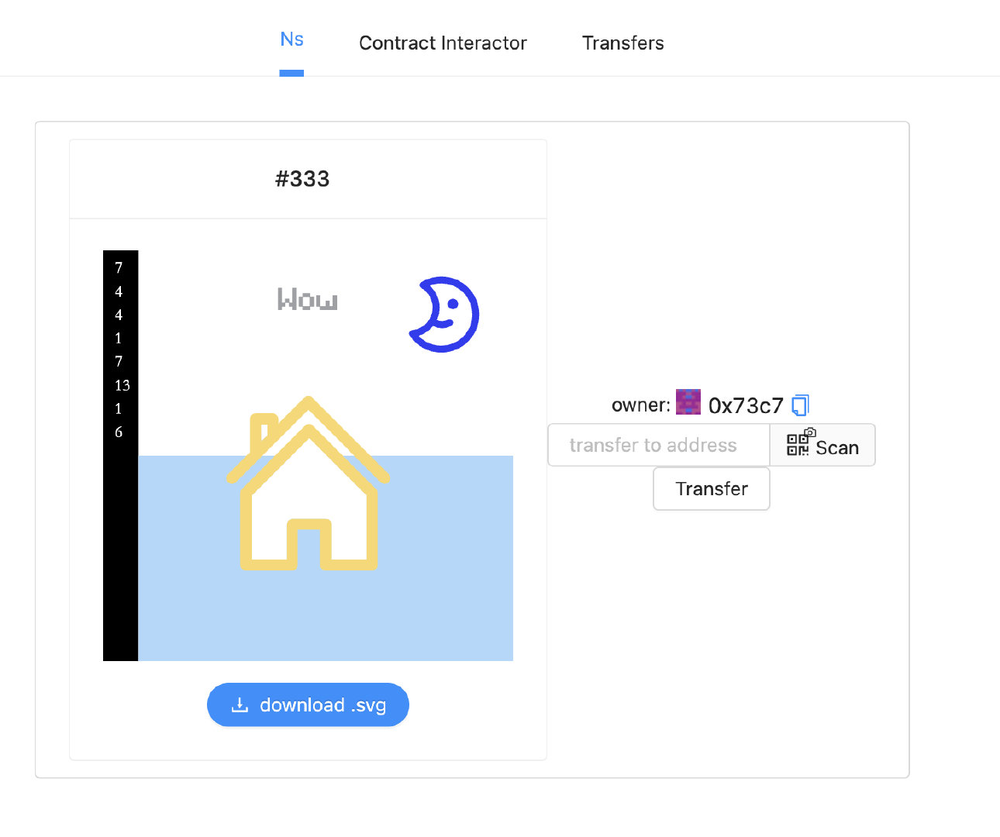

# TaiShang NFT Wallet

> Show, mint, and send your abstract NFTs!

# 🏃‍♀️ Quick Start
Required: [Node](https://nodejs.org/dist/latest-v12.x/) plus [Yarn](https://classic.yarnpkg.com/en/docs/install/#mac-stable) and [Git](https://git-scm.com/downloads)

```
git clone https://github.com/WeLightProject/Tai-Shang-NFT-Wallet.git
cd packages/hardhat/contracts
git submodule update --init ./
```
```
cd ../../../
yarn install
```

```
export REACT_APP_TAI_SHANG_NFT_PARSER="https://taishang.leeduckgo.com/taishang/api/v1/parse?handler_id=78a8600956af0b56cd53b1ea68e9a3f32623e47d5d&type=n"
export REACT_APP_BASE_URL="https://leeduckgo.github.io"

cd Tai-Shang-NFT-Wallet
yarn chain
```

> in a second terminal window:

```
cd Tai-Shang-NFT-Wallet
yarn deploy
```

It will deploy the contract to local chain:



> in a third terminal window:

```
export SKIP_PREFLIGHT_CHECK=true
yarn start
```

📱 Open http://localhost:3000 to see the app



- get Faucet
- Claim the NFT U like
- See it in your Collection

For a more in-depth explanation, documentation, quick start guide, tutorials, tips and many more resources, visit our documentation site: [docs.scaffoldeth.io](https://docs.scaffoldeth.io) 

# 💬 Support Chat

Join the telegram [support chat 💬](https://t.me/joinchat/KByvmRe5wkR-8F_zz6AjpA) to ask questions and find others building with 🏗 scaffold-eth!

Contact the Developers for TaiShang NFT Wallet:


